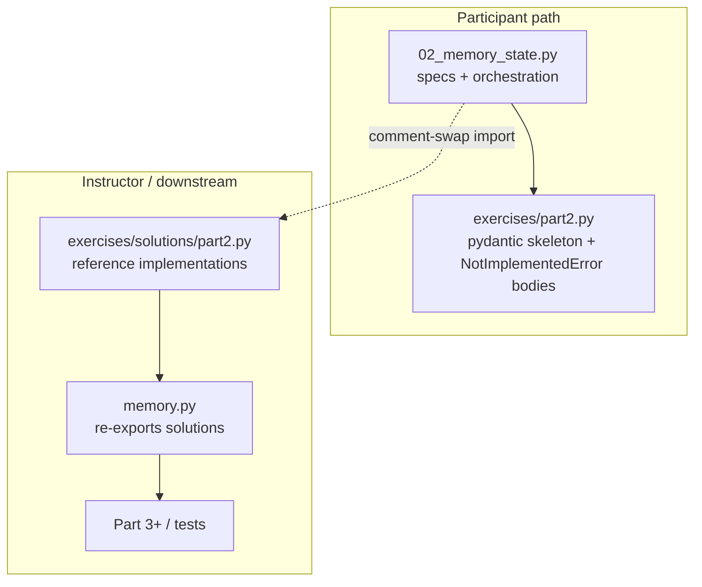

# Part 2: exercises/part2.py split (Part 4 pattern)

**Status:** Implemented  
**Created:** 2026-06-13

Refactor Part 2 so learners implement memory **method bodies** in `exercises/part2.py`, reference code lives in `exercises/solutions/part2.py`, and the notebook holds specs + orchestration only — mirroring Part 4's `part4.py` / `04_workflows.py` split.

**Do not update** [`LLD.md`](./LLD.md) Implementation Status as part of this work.

---

## Target architecture



| File | Role | Part 4 analog |
|------|------|---------------|
| `build_deep_research_agent/exercises/part2.py` | Pydantic skeleton + stub method bodies | `exercises/part4.py` |
| `build_deep_research_agent/exercises/solutions/part2.py` | Full implementations | `exercises/solutions/part4.py` |
| `build_deep_research_agent/memory.py` | Thin re-export for library consumers | N/A |
| `notebooks/02_memory_state.py` | Specs + Marimo wiring + LLM UI | `04_workflows.py` |

---

## 1. Learner module — pydantic skeleton (Part 4 stub style)

Part 4 gives learners **function signatures + docstrings + `raise NotImplementedError`**. Part 2 does the same with **frozen pydantic class scaffolds**: storage fields and `model_config` are provided; learners implement method bodies only.

### `build_deep_research_agent/exercises/part2.py` (new)

```python
"""Part 2 memory exercises — learner stubs (edit this file)."""

from __future__ import annotations

from pydantic import BaseModel, Field

from build_deep_research_agent.models import CitationRecord, Message


class AppendOnlyMemory(BaseModel):
    """Append-only conversation history — implement method bodies below."""

    model_config = {"frozen": True}
    history: tuple[Message, ...] = Field(default_factory=tuple)

    def append(self, message: Message) -> AppendOnlyMemory:
        """Implementation spec: notebooks/02_memory_state.py (ex_implementation_specs)."""
        raise NotImplementedError(
            "Implement append in build_deep_research_agent/exercises/part2.py"
        )

    def messages(self) -> list[Message]:
        raise NotImplementedError(
            "Implement messages in build_deep_research_agent/exercises/part2.py"
        )


class CitationMemory(BaseModel):
    """Citation metadata + snippets — implement method bodies below."""

    model_config = {"frozen": True}
    entries: tuple[tuple[CitationRecord, str], ...] = Field(default_factory=tuple)

    def add(self, citation: CitationRecord, snippet: str) -> CitationMemory:
        raise NotImplementedError(
            "Implement add in build_deep_research_agent/exercises/part2.py"
        )

    def as_context(self) -> str:
        raise NotImplementedError(
            "Implement as_context in build_deep_research_agent/exercises/part2.py"
        )
```

- Imports: `BaseModel`, `Field` from pydantic; `Message`, `CitationRecord` from `models.py` only.
- Docstrings point to notebook **`ex_implementation_specs`** (not full steps — mirror Part 4).
- **No** `format_citations_for_context` import in learner module.

### `build_deep_research_agent/exercises/solutions/part2.py` (new)

- Move current `build_deep_research_agent/memory.py` class bodies here verbatim.
- Keep `# @spec MEM-CHAT-001/002/003` on `AppendOnlyMemory` methods and `# @spec MEM-CITE-001/002/003/004` on `CitationMemory` methods.

### `build_deep_research_agent/memory.py` (shrink)

```python
"""Append-only chat and citation memory for Part 2 exercises."""

from build_deep_research_agent.exercises.solutions.part2 import (
    AppendOnlyMemory,
    CitationMemory,
)

__all__ = ["AppendOnlyMemory", "CitationMemory"]
```

- Re-export only — no `@spec` anchors here (they live on solutions method bodies).
- Keeps `tests/test_memory.py` and future Part 3 imports stable.

---

## 2. Tests — mirror Part 4 split

### `tests/test_memory.py`

- **Unchanged** — continues testing via `from build_deep_research_agent.memory import ...` (solutions re-export).

### `tests/test_exercises_part2.py` (new)

Pattern from `tests/test_exercises_part4.py`:

| Test | Asserts |
|------|---------|
| `test_learner_append_raises_not_implemented` | `learner_part2.AppendOnlyMemory().append(msg)` → `NotImplementedError` |
| `test_learner_messages_raises_not_implemented` | `learner_part2.AppendOnlyMemory().messages()` → `NotImplementedError` |
| `test_learner_add_raises_not_implemented` | `learner_part2.CitationMemory().add(citation, snippet)` → `NotImplementedError` |
| `test_learner_as_context_raises_not_implemented` | `learner_part2.CitationMemory().as_context()` → `NotImplementedError` |
| `test_solutions_append_preserves_order` | One smoke test on `solutions_part2` (e.g. append order) |

---

## 3. Notebook refactor — match Part 4 spine

**Editing approach:** Use **marimo-pair** (`ctx.edit_cell` + `ctx.run_cell`) if a session is open on `02_memory_state.py`. Otherwise write structural changes to disk, then open marimo and run dependents.

### Cell plan (all named)

| Cell | `@spec` | Purpose |
|------|---------|---------|
| `intro` | — | Add: edit **`exercises/part2.py`**; restart kernel after saving |
| `how_this_notebook_works` | — | Part 4 pattern: code in `part2.py`, specs in markdown, kernel restart |
| `instructor_note` | `TUT-MARIMO-015` (reuse) | Comment-swap in **`part2_exercises`** |
| `part2_exercises` | `MEM-EX-003`, `TUT-MARIMO-022` | Single import point; returns `(part2,)` |
| `ex_implementation_specs` | `MEM-EX-002`, `TUT-MARIMO-023` | `@app.function(hide_code=True)` — step-by-step method specs |
| `discussion` | `MEM-CHAT-020` | Restore facilitator prompts (currently missing from notebook) |
| `setup` | — | Fixtures, `build_messages`, `make_research_bot` — **no** memory class imports |
| `controls` | — | Unchanged |
| `ex1_append_only` | `MEM-CHAT-010/011/012` | Takes `part2` param; `part2.AppendOnlyMemory()` |
| `ex2_citation` | `MEM-CITE-010/011` | Takes `part2` param; `part2.CitationMemory()` |
| `ex3_compare` | `MEM-COMP-*` | Takes `part2` param |
| `handoff` | `MEM-COMP-010` | Unchanged |

### `part2_exercises` cell (mirror `part4_exercises`)

```python
from build_deep_research_agent.exercises import part2

# Instructors: swap imports to load reference solutions.
# from build_deep_research_agent.exercises.solutions import part2

return (part2,)
```

### `ex_implementation_specs` content

Publish in markdown (detailed steps like Part 4 **`ex1_implementation_specs`**):

**`AppendOnlyMemory.append(message) -> AppendOnlyMemory`**

1. Return a **new** `AppendOnlyMemory` with `history=(*self.history, message)`.
2. Do not mutate `self` (class is already `frozen=True`).

**`AppendOnlyMemory.messages() -> list[Message]`**

1. Return `list(self.history)` in append order.

**`CitationMemory.add(citation, snippet) -> CitationMemory`**

1. Return a new instance with `entries=(*self.entries, (citation, snippet))`.

**`CitationMemory.as_context() -> str`**

1. If `entries` is empty, return `"(no citations in memory)"`.
2. Dedupe by `citation.key`; later entry wins.
3. For each surviving entry, call `format_citations_for_context([citation])` and append `\nSnippet: {snippet}`.
4. Join blocks with `\n\n`.

Reference: `exercises/solutions/part2.py`.

### Reactive wiring

- Exercise cells declare `part2` as a function parameter (Marimo dependency from `part2_exercises`).
- `setup` no longer returns `AppendOnlyMemory` / `CitationMemory`.
- Notebook retains orchestration only: Marimo UI, LLM calls, display.

---

## 4. EARS — specified IDs

Add these before/during implementation; mark `[x]` and add `@spec` anchors in the same change.

### `docs/designs/memory/chat-history-EARS.md`

New section **Part 2 Exercise module**:

- [ ] **MEM-EX-001**: `exercises/part2.py` shall define frozen pydantic skeleton classes `AppendOnlyMemory` and `CitationMemory` with `NotImplementedError` method bodies; `exercises/solutions/part2.py` shall contain the reference implementations. `@spec` → method bodies in `part2.py` / `solutions/part2.py`.
- [ ] **MEM-EX-002**: Notebook `02_memory_state.py` shall publish step-by-step implementation specs for memory method bodies in **`ex_implementation_specs`**, not in learner module docstrings. `@spec` → `ex_implementation_specs` cell.
- [ ] **MEM-EX-003**: Notebook `02_memory_state.py` shall import the exercise module directly in **`part2_exercises`** without `importlib.reload`; participants shall restart the kernel after editing `part2.py`. `@spec` → `part2_exercises` cell.

Update existing notebook EARS (wording only — stay `[x]`):

- **MEM-CHAT-010/011/012**: change "shall use `AppendOnlyMemory`" → "shall use `part2.AppendOnlyMemory` from the exercise import cell".

### `docs/designs/memory/citation-memory-EARS.md`

- **MEM-CITE-010/011**: change to reference `part2.CitationMemory` from exercise import.
- Add cross-reference to **MEM-EX-001** in Related Documents.

### `docs/designs/tutorial-delivery/marimo-conventions-EARS.md`

- [ ] **TUT-MARIMO-022**: Part 2 shall not use `importlib.reload` on exercise modules; materials shall instruct kernel restart after editing `exercises/part2.py`. `@spec` → `part2_exercises` cell (or `how_this_notebook_works`).
- [ ] **TUT-MARIMO-023**: Part 2 shall publish memory method implementation specs in notebook markdown cells; learner `exercises/part2.py` shall remain pydantic skeletons with stub bodies, with full reference implementations in `exercises/solutions/part2.py`. `@spec` → `ex_implementation_specs` cell.

(Optionally extend **TUT-MARIMO-014** checklist note to mention Part 2 `part2_exercises` when marking complete.)

### `tests/test_exercises_part2.py`

- [ ] **MEM-EX-030**: `tests/test_exercises_part2.py` shall verify learner stub methods raise `NotImplementedError`. `@spec` → each learner-stub test.

---

## 5. Quality gates

- `pixi run ruff format` / `ruff check` on new/edited Python files.
- `pixi run test tests/test_memory.py tests/test_exercises_part2.py`
- Smoke: learner `part2.AppendOnlyMemory().append(...)` raises; `from build_deep_research_agent.memory import AppendOnlyMemory` works.

---

## 6. Implementation checklist

- [ ] Create `build_deep_research_agent/exercises/solutions/part2.py` (move `memory.py` bodies + `@spec`)
- [ ] Create `build_deep_research_agent/exercises/part2.py` (pydantic skeleton stubs)
- [ ] Shrink `build_deep_research_agent/memory.py` to re-export from solutions
- [ ] Add `tests/test_exercises_part2.py`
- [ ] Refactor `notebooks/02_memory_state.py` (Part 4 spine + `part2` wiring)
- [ ] Add/mark EARS (`MEM-EX-*`, `TUT-MARIMO-022/023`)
- [ ] Run ruff + targeted tests

---

## Out of scope

- LLD Implementation Status update
- `truncate(max_turns)`
- Richer Marimo UI beyond Part 4-style instructional cells
- Fixing `pocketflow` / eager `__init__.py` imports (see below)

---

## Related issue: pocketflow / package imports

Part 2 does **not** use PocketFlow directly. The setup cell fails because **any** `from build_deep_research_agent.* import ...` runs `__init__.py`, which eagerly imports `agents` → `mcp.client` → `llamabot.mcp` → `pocketflow`. Pixi installs plain `llamabot` without the `pocketflow` extra.

Fix options (orthogonal to this plan, but recommended before classroom use):

1. Add `pocketflow` to `pyproject.toml` dependencies.
2. Lazy imports in `build_deep_research_agent/__init__.py`.
3. Lazy imports in `mcp/client.py` for `MCPClientManager`.
